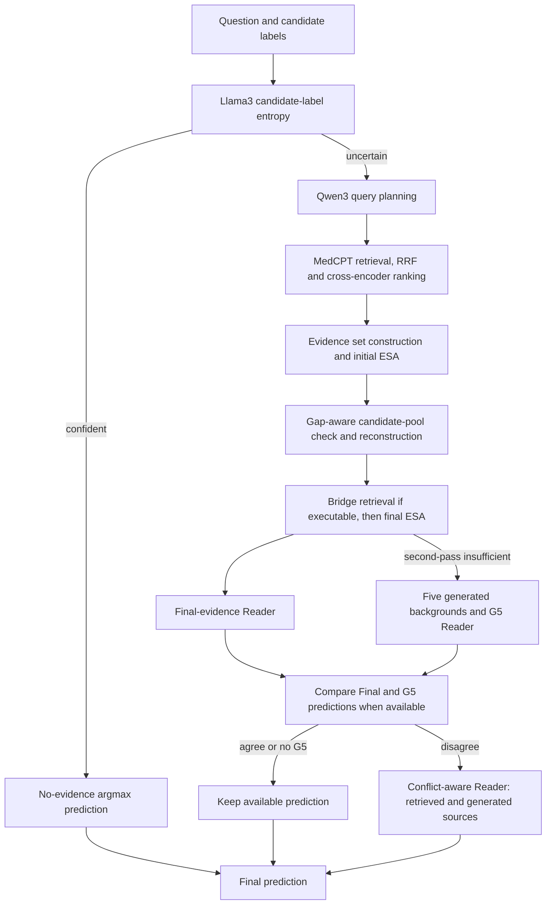

# U-GAP

A standalone release candidate of U-GAP for medical question answering: uncertainty-gated retrieval, evidence-gap analysis, targeted background generation, and conflict-aware answer fusion.

**Release status:** the implementation is packaged independently of historical experiment outputs. Redistribution permission for inherited KGARevion code still needs confirmation. Read [LICENSE](LICENSE) and [THIRD_PARTY_NOTICES.md](THIRD_PARTY_NOTICES.md) before publishing or redistributing this directory. This is not an MIT-licensed release.

## Method



The diagram is schematic: already-sufficient evidence skips gap correction; absent executable gaps and failed analyses follow explicit fallbacks. Cross-encoder gap scores are relevance proxies, **not** entailment or sufficiency labels. Pool reconstruction does not add another immediate Qwen ESA call. There is at most one Bridge retrieval round.

The Gate uses normalized candidate-label entropy with default threshold **0.02**. Confident predictions use the highest-scoring label, not free-form generation. All evidence/G5/fusion Readers use **no-logprob greedy generation**, with the existing Direct task instructions and source-specific context blocks. Generated knowledge is not represented as retrieved evidence.

G5 is restricted to `route == "retrieve"` and `stop_reason == "one_followup_limit_reached"`. Generator prompts contain the question stem and neutralized final information need, without answer options. Missing final gaps are logged and retain the Final Reader result. The fusion prompt does not reveal the competing answer labels. Invalid fusion output falls back to a valid G5, Final Reader, then Gate prediction, in that order; gold labels never repair predictions.

## Installation

Target: Linux, Python 3.10, NVIDIA CUDA GPU. The two 8B models are loaded in separate stages, not together. A 24 GB GPU was used in the research workflow, but available memory and input lengths matter; this extracted package has not yet completed a real-GPU release smoke test. Do not run competing GPU jobs during the first test.

Use separate inference and legacy MedRAG retrieval environments to avoid incompatible `transformers` / `sentence-transformers` versions:

```bash
python3.10 -m venv .venv
.venv/bin/python -m pip install --upgrade pip
.venv/bin/python -m pip install -r requirements.txt

python3.10 -m venv .venv-retrieval
.venv-retrieval/bin/python -m pip install --upgrade pip
.venv-retrieval/bin/python -m pip install -r requirements-retrieval.txt

git clone https://github.com/gzxiong/MedRAG.git external/MedRAG
source .venv/bin/activate
cp configs/default.yaml configs/local.yaml
```

The requirement files specify a compatibility target, not a verified historical environment lock. A compatible CUDA driver and PyTorch installation are required. Record the actual installed versions after validation. MedRAG is an external dependency, not vendored code; pin and record the checkout used. See [data preparation](docs/data_preparation.md).

## Models, Data and Configuration

Prepare local Llama3-8B-Instruct, Qwen3-8B, MedCPT query/article/cross-encoder checkpoints, benchmark questions, and MedText chunks/indexes. No weights, licensed benchmark questions, corpus passages, or indexes are shipped here. Model access and data redistribution terms must be handled separately.

Edit `configs/local.yaml` with your paths. The default file is JSON-compatible YAML; ordinary YAML is also accepted with PyYAML installed. **Relative paths are resolved from this repository root, not from the configuration file's directory.** `~` and environment variables are supported. Set `retrieval_python` to the absolute path of `.venv-retrieval/bin/python`; leaving it empty uses the inference interpreter, which normally does not have the legacy retrieval dependencies.

Key defaults:

| Configuration | Default | Meaning |
| --- | --- | --- |
| `option_entropy_threshold` | 0.02 | Entropy at or above this value enters RAG |
| `num_views`, `per_query_k`, `rrf_k` | 3, 8, 100 | Planned views, global hits per query, RRF constant |
| `pool_size` | 32 | Candidate pool limit |
| `min_selected`, `max_selected` | 4, 8 | Evidence selection bounds, subject to available candidates/budgets |
| `evidence_chars`, `context_chars` | 1200, 8000 | Passage and evidence-set character budgets |
| `pool_check_backend`, `pool_ce_topk_per_gap` | cross_encoder, 3 | Gap-aware candidate-pool check |
| `plan_tokens`, `esa_tokens` | 700, 1600 | Maximum Qwen output tokens |
| `qwen_context`, `context_limit` | 8192, 8192 | Qwen and Llama context budgets |
| `answer_tokens` | 96 | Reader output-token limit |
| `generation_documents` | 5 | Generated passages per eligible question |
| `g5_temperature`, `g5_top_p`, `g5_top_k` | 1.2, 0.9, 50 | Existing G5 sampling settings |
| `seed` | 42 | Base for per-document generation seeds |

Each generated passage has a 256-token output limit. Reader decoding is greedy; the original Reader initializes seed 42. G5 is sampled with recorded per-document seeds. Fixed seeds do not guarantee bitwise equality across different hardware, libraries or kernels. Changing the document count changes the method and seeds; a count smaller than the number of retained gap needs is rejected rather than silently dropping gaps.

## Fresh Small Run

First check input/configuration without loading models or creating outputs:

```bash
python run.py --config configs/local.yaml \
  --questions examples/sample_questions.jsonl --check
```

After preparing checkpoints and indexes, run the following from a **new, empty** output location. Setting the threshold to zero here is only a wiring test that forces all three examples through RAG; the paper configuration remains 0.02.

```bash
export CUDA_VISIBLE_DEVICES=0
export TOKENIZERS_PARALLELISM=false
export HF_HUB_OFFLINE=1
export TRANSFORMERS_OFFLINE=1

python -u run.py --config configs/local.yaml \
  --questions examples/sample_questions.jsonl \
  --set option_entropy_threshold=0.0 \
  --output-dir outputs/smoke_fresh_v1 --stage all

python evaluate.py \
  --predictions outputs/smoke_fresh_v1/07_final_predictions.jsonl \
  --expected-total 3 --output outputs/smoke_fresh_v1/evaluation.json
```

Acceptance: the command finishes, there are three unique final predictions, zero invalid predictions, and evaluation reports three labeled records. Accuracy on these original toy questions is not a benchmark result. G5/fusion may legitimately be skipped if the examples do not reach their routing conditions. The offline tests exercise these branches explicitly. See [validation status](docs/validation.md).

## Full Benchmark Run

```bash
python -u run.py --config configs/local.yaml --dataset medqa \
  --output-dir outputs/medqa_v1 --stage all

python evaluate.py --predictions outputs/medqa_v1/07_final_predictions.jsonl \
  --expected-total 1273 --output outputs/medqa_v1/evaluation.json
```

Supported dataset keys are `medqa`, `mmlu` (alias `mmlu_med`), `pubmedqa`, and `bioasq`. The benchmark file is indexed by dataset; passing it does not run every dataset. Use a different output directory per dataset/configuration. Expected test counts in the research setup were 1273, 1089, 500, and 618 respectively; verify your actual split instead of silently assuming those counts. `--limit 3` runs a small sorted-ID subset; `--set expected_total=3` can enforce its size.

This package deliberately does not expose old experiment runners as public commands. Individual stages are available for debugging or resumption: `audit`, `gate`, `rag`, `reader`, `g5`, `fusion`, `finalize`. `all` runs them in order. `audit` checks local asset locations and creates a manifest; `--check` is the no-write input check. Repeating the **same** command resumes complete stage records within that run. Input/configuration/code changes require a new output directory. No historical experiment directory is an input.

## Outputs and Evaluation

| File/directory | Contents |
| --- | --- |
| `00_manifest.json` | Effective configuration, input/source checksums, model metadata |
| `01_gate_predictions.jsonl` | Scores, entropy, no-RAG predictions and routing |
| `02_uncertain_source_keys.json` | Unique IDs entering fresh RAG |
| `rag_uncertain/` | Fresh planning, candidates, evidence sets, ESA and follow-up records |
| `03_final_evidence_reader_predictions.jsonl` | Final-evidence Reader predictions and prompts |
| `04_g5_generated_backgrounds.jsonl` | Generated passages, prompts, sampling settings and seeds |
| `05_g5_predictions.jsonl` | Generation-only Reader predictions |
| `06_conflict_fusion_predictions.jsonl` | Disagreement fusion predictions and source context |
| `07_final_predictions.jsonl` | All questions, final routes and intermediate predictions |
| `08_summary.json` | Benchmark accuracy and route summary |
| `09_g5_skipped_missing_gap.jsonl` | Missing-gap skips, when present |
| `run.log` | Stage progress; RAG subprocess progress is also printed to stdout |

Files for empty optional branches may be absent. `evaluate.py` verifies unique IDs, expected count, legal final labels and gold labels; invalid predictions count as incorrect. Its `--output` refuses to overwrite an existing report. It can also report unlabeled records without assigning them accuracy; use it rather than the internal benchmark summary for unlabeled inputs.

## Code Map

The original runtime file names are retained to minimize behavioral changes. Only required components were extracted; the presence of a historical-looking helper name does not require running that historical experiment.

| Component | Implementation |
| --- | --- |
| Public configuration and CLI | `run.py`, `configs/default.yaml` |
| Stage orchestration and routing | `tools/run_final_method_end_to_end.py` |
| Candidate-label entropy | `src/uncertainty_gate.py`, `src/utils.py` |
| Retrieval/ranking | `src/evidence_gap_models.py` |
| Evidence construction, ESA and Bridge | `src/evidence_gap.py`, `tools/run_evidence_gap_rag.py` |
| Direct instruction/answer format/parser | `action/answer.py`, `src/promptTemplate.py`, `src/answer_decoding.py` |
| Final Reader context | `src/evidence_analysis_reader.py`, `src/selected_evidence_retriever.py` |
| Background prompts and G5 | `src/parametric_generation_multidoc.py`, `src/parametric_generation_diagnostic.py` |
| Conflict-aware prompt | `src/conflict_aware_generation_fusion.py` |

[Source map](docs/source_map.json) records extraction origins. Prompts, validators and failure handling are included in the code, not hidden in an external service.

## Result Scope and Limitations

This release is research software, not a clinical decision tool. Generated passages may be incorrect even when an answer is correct. Corpus/task mismatch can hurt performance, particularly on literature-oriented yes/no tasks. The Gate's logprob baseline is not interchangeable with a greedy Direct baseline.

Historical experiments included test-set configuration exploration, including the MedQA entropy threshold. Those observations must be described as exploratory, not as performance on a previously unseen held-out test. This package makes no new accuracy claim; freeze settings on a legitimate development split for a new confirmatory comparison. Compare methods under matched datasets, corpus, checkpoints, prompts, decoding, context budgets and parsing. A release smoke test does not validate a paper's accuracy table.

## Acknowledgments

U-GAP builds on [KGARevion](https://github.com/mims-harvard/KGARevion), by Su et al., ICLR 2025, and uses external [MedRAG](https://github.com/gzxiong/MedRAG), [MedCPT](https://github.com/ncbi/MedCPT), Llama and Qwen resources. Inherited code is not claimed as original U-GAP work. Preserve the upstream notices and confirm redistribution rights before public release. Add the final U-GAP paper citation when available; no placeholder paper metadata is asserted here.
